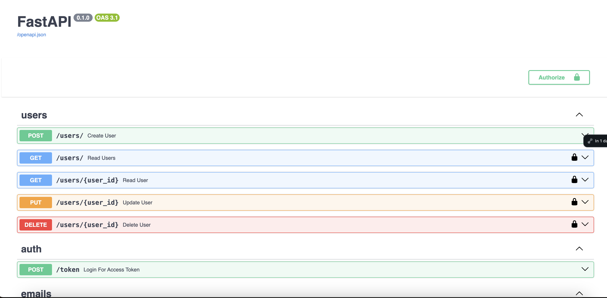

# Mailicious-BE
Backend for Mailicious Product

1. Create venv - `python -m venv venv`
2. Use your venv 
3. Install the reqs - `pip install -r requirments.txt`
4. run the server - `uvicorn app.main:app`
5. browse http://127.0.0.1:8000/docs#/
6. You should see that page:

Easy